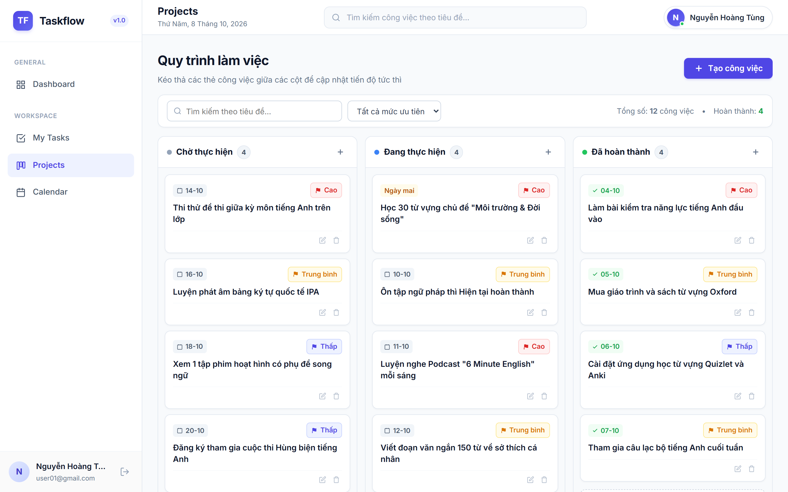
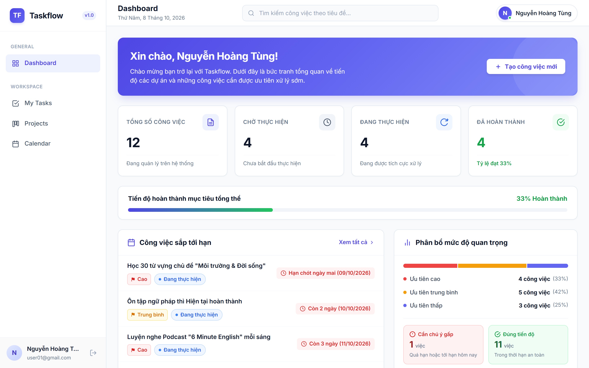

# 📋 Task Management System

> **Bài tuyển dụng:** Thực tập sinh Backend / Fullstack Developer tại **TechVanguard**  
> **Ứng viên:** Nguyễn Hoàng Tùng  
> **Nhánh làm việc:** `feature/task-management-system`


Ứng dụng **quản lý công việc cá nhân** cho phép người dùng đăng ký tài khoản, quản lý toàn bộ vòng đời công việc (Tạo → Theo dõi → Hoàn thành), xem thống kê trên Dashboard và kéo thả trực quan trên Kanban Board.

### 🖥️ Giao diện thực tế của ứng dụng (Kanban Board kéo thả & Dashboard thống kê)





---

## 📌 Mục lục

- [Công nghệ sử dụng](#-công-nghệ-sử-dụng)
- [Cấu trúc dự án](#-cấu-trúc-dự-án)
- [Hướng dẫn cài đặt và chạy](#-hướng-dẫn-cài-đặt-và-chạy)
  - [Cách 1: Docker Compose (Khuyên dùng)](#cách-1-docker-compose-khuyên-dùng---1-lệnh-duy-nhất)
  - [Cách 2: Chạy thủ công trên IDE](#cách-2-chạy-thủ-công-trên-ide)
- [Tài khoản test](#-tài-khoản-test)
- [API Endpoints](#-api-endpoints)
- [Bảng đối chiếu tính năng](#-bảng-đối-chiếu-tính-năng-với-đề-bài)
- [Kiểm thử (Testing)](#-kiểm-thử-testing)
- [Tài liệu bổ sung](#-tài-liệu-bổ-sung)

---

## 🛠 Công nghệ sử dụng

| Tầng | Công nghệ cốt lõi | Phiên bản |
|---|---|---|
| **Backend** | Java, Spring Boot, Spring Security, Spring Data JPA, JWT | Java 17, Spring Boot 3.3.5 |
| **Frontend** | React, Vite, Axios, React Router | React 19, Vite 8 |
| **Database** | MySQL | 8.0 |
| **Migration** | Flyway | Tích hợp Spring Boot |
| **API Docs** | Springdoc OpenAPI (Swagger UI) | Tự động sinh tại `/swagger-ui.html` |
| **Testing** | JUnit 5, Mockito | 18 test cases |
| **CI/CD** | GitHub Actions | Workflow `.github/workflows/ci.yml` |
| **DevOps** | Docker, Docker Compose, Nginx | Multi-stage build |

---

## 📁 Cấu trúc dự án

```
Task-Management-System/
├── backend/                          # Spring Boot API
│   ├── src/main/java/com/taskmanager/
│   │   ├── config/                   # SecurityConfig, CorsConfig
│   │   ├── controller/               # AuthController, TaskController, DashboardController, UserController
│   │   ├── dto/                      # Request & Response DTOs
│   │   ├── entity/                   # User, Task (JPA Entities)
│   │   ├── enums/                    # TaskStatus, TaskPriority
│   │   ├── exception/                # AppException, GlobalExceptionHandler
│   │   ├── repository/               # UserRepository, TaskRepository
│   │   ├── security/                 # JwtUtil, JwtAuthFilter, CustomUserDetailsService
│   │   ├── service/                  # AuthService, TaskService, DashboardService, UserService
│   │   └── specification/            # TaskSpecification (Dynamic Filter)
│   ├── src/test/java/com/taskmanager/
│   │   └── service/                  # AuthServiceTest, TaskServiceTest (Unit Tests)
│   ├── Dockerfile                    # Multi-stage build (Temurin 17)
│   └── pom.xml
│
├── frontend/                         # React SPA (Vite)
│   ├── src/
│   │   ├── components/               # TaskModal, ConfirmModal, Sidebar, Navbar, Toast, Badges...
│   │   ├── pages/                    # Login, Register, Dashboard, Tasks, Kanban, Calendar, Profile
│   │   ├── services/                 # api.js, authService, taskService, dashboardService, userService
│   │   └── utils/                    # constants.js, dateUtils.js
│   ├── nginx.conf                    # Nginx reverse proxy config
│   ├── Dockerfile                    # Multi-stage build (Node 20 + Nginx Alpine)
│   └── package.json
│
├── database/                         # Flyway migration scripts
│   ├── V1__init_schema.sql           # Tạo bảng users & tasks
│   └── V2__seed_sample_data.sql      # Dữ liệu mẫu (2 users, 24 tasks)
│
├── docs/                             # Tài liệu kỹ thuật
│   ├── DATABASE_DESIGN.md            # Thiết kế CSDL chi tiết (ERD, giải thích từng cột)
│   ├── PROJECT_OVERVIEW.md           # Tổng quan dự án
│   └── TEST_CASES.md                 # Đặc tả chi tiết 18 test cases
│
├── .github/workflows/ci.yml         # GitHub Actions CI Pipeline
├── docker-compose.yml                # Chạy 3 dịch vụ (MySQL + Backend + Frontend)
├── .env.example                      # Mẫu biến môi trường (không chứa secret thật)
└── README.md                         # ← Bạn đang đọc file này
```

---

## 🚀 Hướng dẫn cài đặt và chạy

### Yêu cầu hệ thống

| Phần mềm | Phiên bản tối thiểu | Ghi chú |
|---|---|---|
| **Git** | 2.x | Clone mã nguồn |
| **Docker Desktop** | 20.x+ | *Cách 1 (Docker Compose)* |
| **Java JDK** | 17+ | *Cách 2 (IDE)* |
| **Node.js** | 20+ | *Cách 2 (IDE)* |
| **MySQL** | 8.0 | *Cách 2 (IDE)* |

---

### Cách 1: Docker Compose (Khuyên dùng) — 1 lệnh duy nhất

> ✅ **Cách nhanh nhất.** Không cần cài Java, Node.js hay MySQL. Chỉ cần có Docker Desktop.

**Bước 1:** Clone dự án

```bash
git clone https://github.com/NHTung-0801/Task-Management-System.git
cd Task-Management-System
```

**Bước 2:** Tạo file `.env` từ mẫu

```bash
cp .env.example .env
```

**Bước 3:** Khởi chạy toàn bộ hệ thống

```bash
docker compose up -d
```

Lệnh này sẽ tự động:
1. Khởi tạo container **MySQL 8.0** và chờ sẵn sàng (healthcheck).
2. Build và chạy **Backend** (Spring Boot, port `8080`) — Flyway tự động tạo bảng và nạp dữ liệu mẫu.
3. Build và chạy **Frontend** (Nginx, port `80`) — Nginx reverse proxy chuyển tiếp `/api/*` về Backend.

**Bước 4:** Truy cập ứng dụng

| Dịch vụ | URL |
|---|---|
| 🖥️ **Giao diện web** | [http://localhost](http://localhost) |
| 📡 **Backend API** | [http://localhost:8080/api](http://localhost:8080/api) |
| 📖 **Swagger UI** | [http://localhost:8080/swagger-ui.html](http://localhost:8080/swagger-ui.html) |

**Dừng hệ thống:**

```bash
docker compose down
```

---

### Cách 2: Chạy thủ công trên IDE

> Dành cho việc phát triển hoặc khi không có Docker Desktop.

**Bước 1:** Clone dự án và tạo file `.env`

```bash
git clone https://github.com/NHTung-0801/Task-Management-System.git
cd Task-Management-System
cp .env.example .env
```

**Bước 2:** Khởi động MySQL

Dự án cấu hình kết nối MySQL mặc định như sau:
| Thông số | Giá trị mặc định | Ghi chú |
|---|---|---|
| **Host / Port** | `localhost:3306` | Cổng MySQL tiêu chuẩn |
| **Database** | `taskmanager` | Tên cơ sở dữ liệu |
| **Username** | `root` | Tài khoản quản trị |
| **Password** | `root` | Khớp với container Docker |

Bạn có 2 lựa chọn để chạy MySQL:

- **Lựa chọn A (Khuyên dùng):** Dùng Docker khởi động nhanh MySQL (đúng chuẩn cấu hình `root` / `root`):
  ```bash
  docker compose up mysql -d
  ```

- **Lựa chọn B:** Dùng MySQL có sẵn trên máy của bạn:
  1. Tạo database trong MySQL:
     ```sql
     CREATE DATABASE IF NOT EXISTS taskmanager;
     ```
  2. Nếu mật khẩu MySQL của bạn khác `root`, bạn có thể đổi trong file `backend/src/main/resources/application.yml` (hoặc đặt biến môi trường `DB_PASSWORD=mật_khẩu_của_bạn`).

**Bước 3:** Chạy Backend (Spring Boot)

```bash
cd backend
./mvnw spring-boot:run
```
> Trên Windows: dùng `mvnw.cmd spring-boot:run`

Backend sẽ khởi động tại `http://localhost:8080`. Flyway sẽ tự động chạy migration tạo bảng và nạp 24 dữ liệu mẫu (bạn không cần chạy script SQL thủ công).

**Bước 4:** Chạy Frontend (Vite Dev Server)

```bash
cd frontend
npm install
npm run dev
```

Frontend sẽ khởi động tại `http://localhost:5173`. Vite proxy tự động chuyển tiếp `/api` về Backend.

| Dịch vụ | URL |
|---|---|
| 🖥️ **Giao diện web** | [http://localhost:5173](http://localhost:5173) |
| 📡 **Backend API** | [http://localhost:8080/api](http://localhost:8080/api) |
| 📖 **Swagger UI** | [http://localhost:8080/swagger-ui.html](http://localhost:8080/swagger-ui.html) |

---

## 👤 Tài khoản test

Khi khởi chạy lần đầu, Flyway tự động nạp dữ liệu mẫu gồm **2 tài khoản** và **24 task đa dạng trạng thái, thân thiện và gần gũi**:

| Username | Password | Email | Họ tên | Bối cảnh dữ liệu |
|---|---|---|---|---|
| `user01` | `Pass12345` | `user01@gmail.com` | Nguyễn Hoàng Tùng | 🎓 **Kế hoạch học tập Tiếng Anh** (12 tasks) |
| `user02` | `Pass12345` | `user02@gmail.com` | Trần Minh Đức | 🚀 **Kế hoạch phát triển dự án Task Manager** (12 tasks) |

> 💡 **Trải nghiệm tính năng User Isolation (Bảo mật cách ly dữ liệu):**  
> Đăng nhập `user01` để xem danh sách công việc học tiếng Anh. Sau đó đăng xuất và đăng nhập `user02` để xem danh sách việc phát triển trang web. Hai tài khoản hoàn toàn độc lập, chứng minh mỗi người dùng chỉ có quyền truy cập dữ liệu của chính mình!  
> *(Bạn cũng có thể tự đăng ký tài khoản mới bất kỳ lúc nào tại trang `/register`)*

---

## 📡 API Endpoints

### Xác thực (Authentication)

| Phương thức | Endpoint | Mô tả | Bảo mật |
|---|---|---|---|
| `POST` | `/api/auth/register` | Đăng ký tài khoản mới | Công khai |
| `POST` | `/api/auth/login` | Đăng nhập, trả JWT token | Công khai |

### Quản lý công việc (Tasks)

| Phương thức | Endpoint | Mô tả | Bảo mật |
|---|---|---|---|
| `POST` | `/api/tasks` | Tạo task mới | 🔒 JWT |
| `GET` | `/api/tasks?page=&size=&keyword=&status=&priority=` | Danh sách task (tìm kiếm, lọc, phân trang) | 🔒 JWT |
| `GET` | `/api/tasks/{id}` | Xem chi tiết task | 🔒 JWT |
| `PUT` | `/api/tasks/{id}` | Cập nhật task | 🔒 JWT |
| `DELETE` | `/api/tasks/{id}` | Xóa task | 🔒 JWT |

### Dashboard thống kê

| Phương thức | Endpoint | Mô tả | Bảo mật |
|---|---|---|---|
| `GET` | `/api/dashboard/stats` | Thống kê tổng quan (tổng task, theo trạng thái) | 🔒 JWT |
| `GET` | `/api/dashboard/upcoming` | Danh sách task sắp hết hạn | 🔒 JWT |

### Hồ sơ người dùng

| Phương thức | Endpoint | Mô tả | Bảo mật |
|---|---|---|---|
| `GET` | `/api/users/profile` | Xem thông tin cá nhân | 🔒 JWT |
| `PUT` | `/api/users/profile` | Cập nhật thông tin cá nhân | 🔒 JWT |
| `PUT` | `/api/users/change-password` | Đổi mật khẩu | 🔒 JWT |

> 📖 **Tài liệu API tương tác đầy đủ:** Truy cập [Swagger UI](http://localhost:8080/swagger-ui.html) khi Backend đang chạy.

---

## 📋 Bảng đối chiếu tính năng với đề bài

### A. Chức năng bắt buộc (MVP) — ✅ Hoàn thành 100%

| # | Yêu cầu theo đề bài | Trạng thái | Chi tiết triển khai |
|:---:|---|:---:|---|
| 1 | Đăng ký, đăng nhập, đăng xuất | ✅ | JWT token, Spring Security, Axios interceptor tự gắn Bearer token |
| 2 | Mật khẩu mã hóa an toàn | ✅ | BCryptPasswordEncoder (salt 10 rounds) |
| 3 | Người dùng chỉ được truy cập dữ liệu của mình | ✅ | **User Isolation**: Lọc theo `user_id`, ném `403 Forbidden` khi truy cập trái phép. Có Unit Test chứng minh |
| 4 | Tạo, xem, sửa, xóa công việc (CRUD) | ✅ | Đầy đủ title, description, status (TODO/IN_PROGRESS/DONE), priority (LOW/MEDIUM/HIGH), due_date |
| 5 | Tìm kiếm theo tiêu đề | ✅ | JPA Specification dynamic filter, tìm kiếm `LIKE %keyword%` |
| 6 | Lọc theo trạng thái và mức ưu tiên | ✅ | Kết hợp đồng thời nhiều bộ lọc status + priority |
| 7 | Phân trang khi dữ liệu lớn | ✅ | Spring Data `Pageable` với `PageResponse` (page, size, totalPages, totalElements) |
| 8 | Dashboard: Tổng số task | ✅ | Thẻ thống kê tổng quan |
| 9 | Dashboard: Số task theo trạng thái | ✅ | 3 thẻ: Chưa bắt đầu (TODO), Đang thực hiện (IN_PROGRESS), Đã hoàn thành (DONE) |
| 10 | Dashboard: Công việc sắp đến hạn | ✅ | Widget danh sách task có deadline trong 7 ngày tới |

### B. Chức năng cộng điểm (Bonus)

| # | Yêu cầu theo đề bài | Trạng thái | Chi tiết triển khai |
|:---:|---|:---:|---|
| B1 | Giao diện Kanban kéo thả | ✅ | 3 cột (To Do / In Progress / Done), kéo thả task giữa các cột, tự động cập nhật trạng thái qua API |
| B2 | Docker Compose khởi chạy ứng dụng | ✅ | 1 lệnh `docker compose up -d` chạy 3 dịch vụ (MySQL + Backend + Frontend). Multi-stage Dockerfile tối ưu |
| B3 | Swagger / OpenAPI cho tài liệu API | ✅ | Springdoc OpenAPI tự sinh docs tương tác tại `/swagger-ui.html` |
| B4 | Database migration & dữ liệu mẫu | ✅ | Flyway: `V1__init_schema.sql` (tạo bảng) + `V2__seed_sample_data.sql` (nạp 2 tài khoản test, 24 task mẫu thân thiện) |
| B5 | Unit test hoặc integration test | ✅ | JUnit 5 + Mockito: **18/18 test cases pass 100%** bao gồm kiểm thử User Isolation Security |
| B6 | CI pipeline chạy test khi push code | ✅ | GitHub Actions: Backend test (Java 17 + MySQL 8.0) & Frontend lint + build (Node 20), chạy song song |
| B7 | Deploy demo lên cloud | ⏸️ Chưa triển khai | Đã có Dockerfile & Compose sẵn sàng, có thể deploy lên Railway/Vercel khi cần |

### C. Tính năng bổ sung (ngoài đề bài, phục vụ trải nghiệm người dùng)

| Tính năng | Mô tả |
|---|---|
| Trang Calendar | Xem công việc trên giao diện lịch tháng, thêm/sửa/xóa task theo ngày |
| Trang Profile | Xem và chỉnh sửa thông tin cá nhân, đổi mật khẩu |
| Toast Notification | Thông báo trạng thái thành công/thất bại sau mỗi thao tác |
| Form Validation | Kiểm tra dữ liệu đầu vào phía client trước khi gọi API |
| Responsive Layout | Sidebar + Navbar thích ứng trên màn hình máy tính và tablet |

---

## 🧪 Kiểm thử (Testing)

### Chạy toàn bộ test suite

```bash
cd backend
./mvnw test
```

### Kết quả thực thi

```
Tests run: 18, Failures: 0, Errors: 0, Skipped: 0
BUILD SUCCESS (Total time: ~12s)
```

### Tổng quan các test case

| Test Class | Số lượng | Nhóm kiểm thử | Thời gian |
|---|:---:|---|:---:|
| `AuthServiceTest` | 6 tests | Đăng ký (thành công, trùng username, trùng email), Đăng nhập (thành công, sai username, sai mật khẩu) | 1.6s |
| `TaskServiceTest` | 11 tests | CRUD Task, Giá trị mặc định, **User Isolation Security** (chặn đọc/sửa/xóa task người khác → 403), Phân trang & Lọc, Chặn khi chưa đăng nhập → 401 | 0.2s |
| `TaskManagerApplicationTests` | 1 test | Khởi tạo Spring Context thành công | 6.5s |

> 📄 **Xem đặc tả chi tiết từng test case (Given/When/Then):** [`docs/TEST_CASES.md`](docs/TEST_CASES.md)

---

## 📂 Tài liệu bổ sung

| Tài liệu | Đường dẫn | Nội dung |
|---|---|---|
| Thiết kế Database | [`docs/DATABASE_DESIGN.md`](docs/DATABASE_DESIGN.md) | ERD, giải thích chi tiết từng cột, ràng buộc khóa ngoại, index |
| Tổng quan dự án | [`docs/PROJECT_OVERVIEW.md`](docs/PROJECT_OVERVIEW.md) | Scope, kiến trúc kỹ thuật, checklist bàn giao |
| Đặc tả Test Cases | [`docs/TEST_CASES.md`](docs/TEST_CASES.md) | 18 test case chi tiết theo chuẩn Given/When/Then |
| Biến môi trường mẫu | [`.env.example`](.env.example) | Template cấu hình DB, JWT, Frontend — không chứa secret thật |

---

## 📄 Checklist bàn giao

Đối chiếu với mục **"5. Sản phẩm ứng viên phải bàn giao"** trong đề bài:

- [x] Pull Request tạo vào repo gốc
- [x] README: hướng dẫn cài đặt và chạy dự án *(file này)*
- [x] File `.env.example`, không chứa secret thật
- [x] Database migration và dữ liệu mẫu/seed *(Flyway V1 + V2)*
- [x] API documentation *(Swagger UI tại `/swagger-ui.html`)*
- [x] Danh sách chức năng đã hoàn thành và chưa hoàn thành *(bảng đối chiếu ở trên)*
- [ ] Video demo 3–5 phút hoặc buổi demo trực tiếp *(sẵn sàng demo trực tiếp khi phỏng vấn)*
